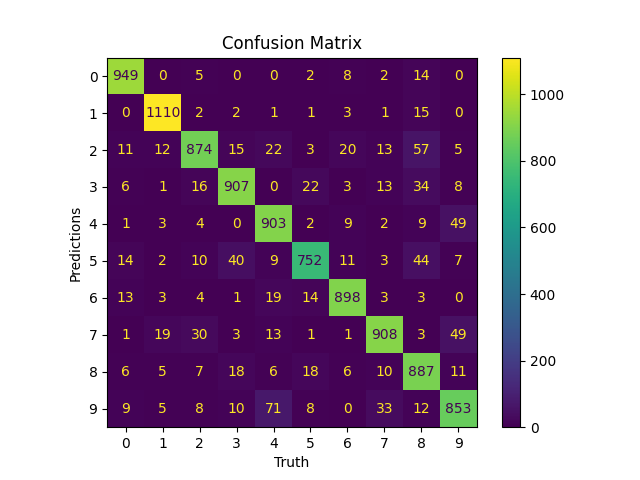
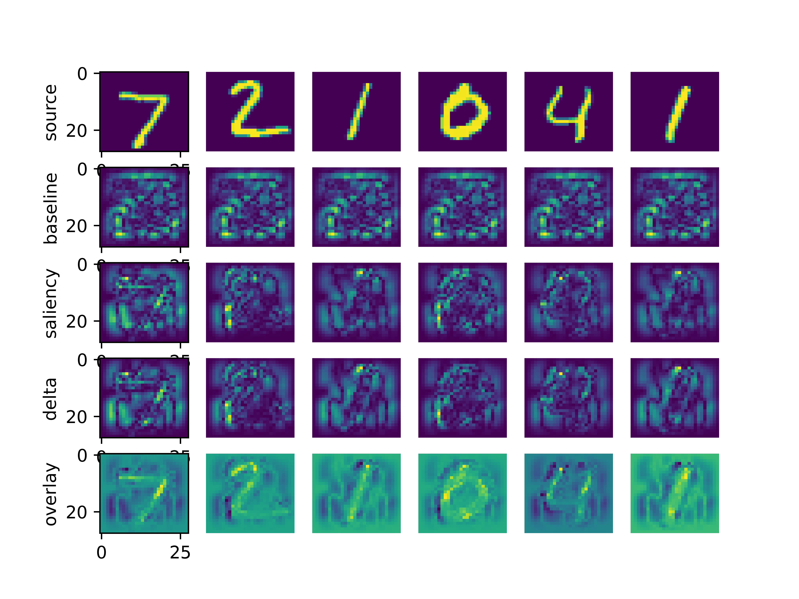

# Explainable AI with MNIST

## Description
Neural networks are difficult to understand because of their 'black box' nature.  Here we will describe three different ways a researcher can interrogate their neural networks to describe what is happening.  The two approaches we showcase here are: (1) **saliency maps** and (2) **projecting embeddings**.

## Training
The `main.py` script has everything you need to get started.  It will download the `MNIST` dataset and start training a model with it.  A confusion matrix will be generated along with the model showing how well it classifies the different classes.  Pictures will be saved to the **logs** folder.

## Confusion Matrix

## Saliency Maps
Once a model has been trained, the script will perform the operations for helping the user understand what the neural network is doing to make its prediction.  The saliency map is broken into several different sub-categories.  

> **source:**  Shows the source image.
>
> **baseline:**  Shows where the neural network focuses attention with an empty image.
>
> **saliency:**  Shows the activations where the network is focused on for the source image.
> 
> **delta:**  Shows the saliency-baseline which removes the baseline noise.
>
> **overlay:**  Shows delta multiplied versus the source.  This is what the neural network is focusing on when performing its inference function!

Colormap:

## Embedding Projections
Another way to gain further insights into your model is through t-SNE or PCA visualizations.  This can be done with Tensorboard on the layer just before the head.  You must use the Chrome browser for this to work.  See example below.

> tensorboard --logdir=./logs/

